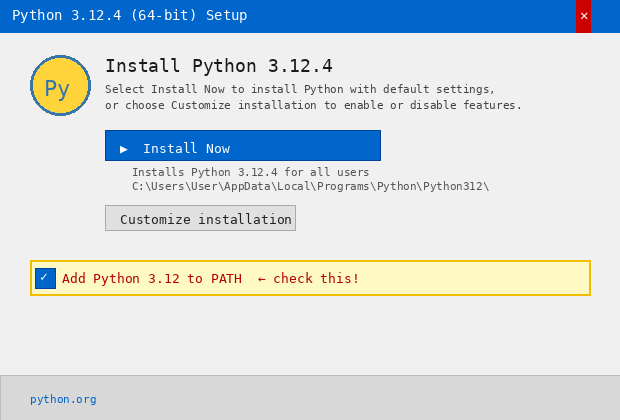
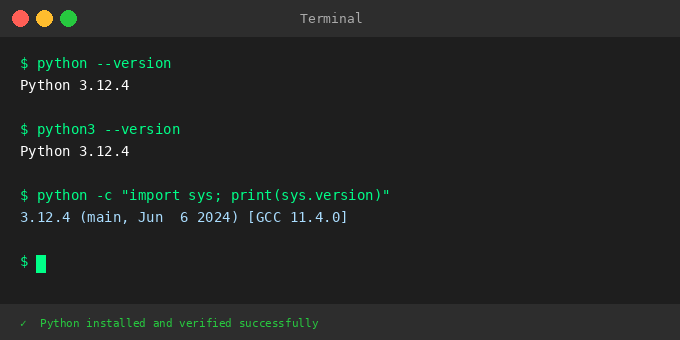

# WL

# Python Setup and Verification

This assignment demonstrates how to install and verify Python, check the Python version from the terminal, and understand why Python is important for AI and Generative AI development.

---

## 1. Install Python

To install Python:

1. Go to the official website: https://www.python.org/downloads/
2. Download the latest stable version for your operating system (Windows / macOS / Linux).
3. Run the installer.
4. **Important (Windows users):** Make sure to check **"Add Python to PATH"** during installation.
5. Complete the installation and restart your terminal if needed.

### Installation Screenshot

The image below shows the Python installer with the **"Add Python to PATH"** option highlighted — make sure this box is checked before clicking Install Now.



---

## 2. Verify Python Installation

After installing Python, open a terminal or command prompt and run:

```bash
python --version
```

### Verification Screenshot

The image below shows the expected terminal output after a successful installation:



You should see output like `Python 3.x.x`. If you see an error, make sure Python was added to your PATH during installation.

---

## Why Python is important for AI/GenAI

Python's simple, readable syntax lets developers focus on AI logic rather than complex code. It has the richest ecosystem of AI/ML libraries, including TensorFlow, PyTorch, and Hugging Face. Its strong community support and easy integration with APIs make it the standard choice for building real-world AI applications.

---

## Demo video

Check out the video here:  
[Verifying your Python installation (and why Python matters for AI/GenAI)](https://www.youtube.com/watch?v=brUVsU59mtA)
